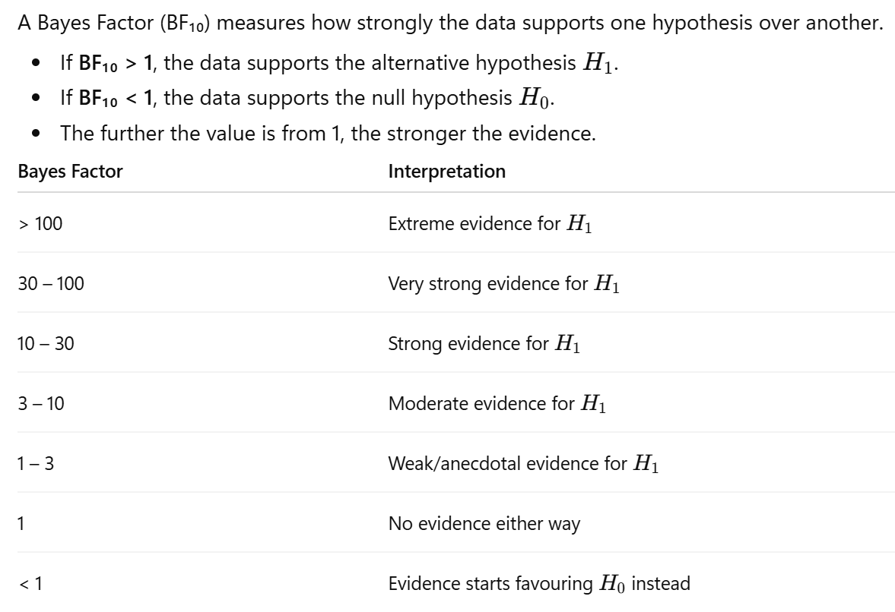
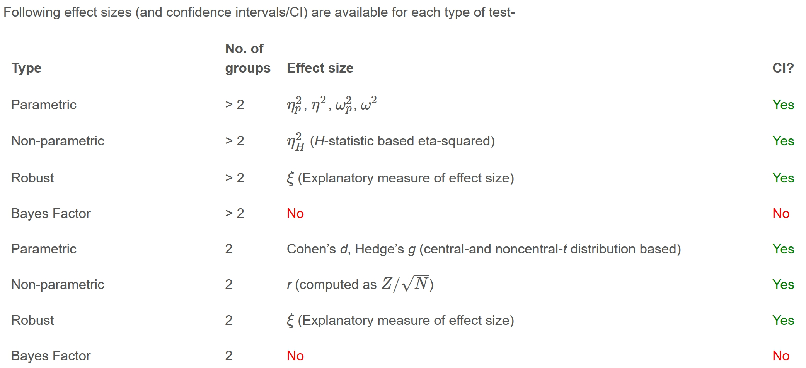
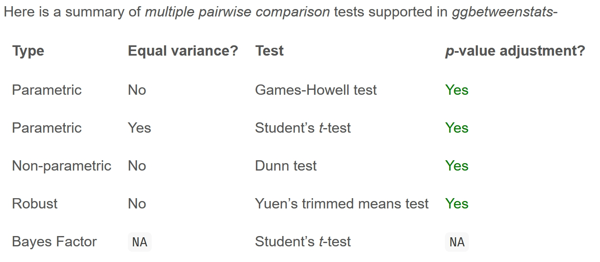

# Visual Statistical Analysis

## Visual Statistical Analysis with ggstatsplot

[ggstatsplot](https://indrajeetpatil.github.io/ggstatsplot/index.html) is an extension of [ggplot2](https://ggplot2.tidyverse.org/) package for creating graphics with details from statistical tests included in the information-rich plots themselves.

- To provide alternative statistical inference methods by default.

- To follow best practices for statistical reporting. For all statistical tests reported in the plots, the default template abides by the APA gold standard for statistical reporting.

## Installing and launching required libraries

In this exercise, we will be using the following R packages: `tidyverse` and `ggstatsplot`.

```{r}
pacman::p_load(ggstatsplot, tidyverse)
```

## Importing Data

Similar to the previous Hands-on exercise, this exercise uses the *read_csv()* of readr package to import Exam_data.csv into R.

```{r}
#| code-fold: true
exam <- read_csv("Data/Exam_data.csv")

exam
```

## Statistical Testing

## One-sample test: gghistostats() method

In the code chunk below, [gghistostats()](https://indrajeetpatil.github.io/ggstatsplot/reference/gghistostats.html) is used to to build an visual of one-sample test on English scores.

:::: panel-tabset
## The Plot

```{r echo=FALSE}
set.seed(1234)

gghistostats(
  data = exam,
  x = ENGLISH,
  type = "bayes",
  test.value = 60,
  xlab = "English scores"
)       
```

## The Code

```{r eval=FALSE}
set.seed(1234)

gghistostats(
  data = exam,
  x = ENGLISH,
  type = "bayes",
  test.value = 60,
  xlab = "English scores"
)       
```

::: callout-note
## Note

Using `set.seed(1234)` ensure that the graph remains the same after every rendering. This removes randomness which we do not want.
:::
::::

Default information: - statistical details - Bayes Factor - sample sizes - distribution summary

## Unpacking the Bayes Factor

- A Bayes factor is the ratio of the likelihood of one particular hypothesis to the likelihood of another. It can be interpreted as a measure of the strength of evidence in favor of one theory among two competing theories.

- That’s because the Bayes factor gives us a way to evaluate the data in favor of a null hypothesis, and to use external information to do so. It tells us what the weight of the evidence is in favor of a given hypothesis.

- When we are comparing two hypotheses, H1 (the alternate hypothesis) and H0 (the null hypothesis), the Bayes Factor is often written as B10.

- The [Schwarz criterion](https://www.statisticshowto.com/bayesian-information-criterion/) is one of the easiest ways to calculate rough approximation of the Bayes Factor.

## How to interpret Bayes Factor

A Bayes Factor can be any positive number. One of the most common interpretations is this one—first proposed by Harold Jeffereys (1961) and slightly modified by [Lee and Wagenmakers](https://www-tandfonline-com.libproxy.smu.edu.sg/doi/pdf/10.1080/00031305.1999.10474443?needAccess=true) in 2013:



## Two-sample mean test: `ggbetweenstats()`

In the code chunk below, [ggbetweenstats()](https://indrajeetpatil.github.io/ggstatsplot/reference/ggbetweenstats.html) is used to build a visual for two-sample mean test of Maths scores by gender.

::: panel-tabset
## The Plot

```{r echo=FALSE}
ggbetweenstats(
  data = exam,
  x = GENDER, 
  y = MATHS,
  type = "np",
  messages = FALSE
)       
```

## The Code

```{r eval=FALSE}
ggbetweenstats(
  data = exam,
  x = GENDER, 
  y = MATHS,
  type = "np",
  messages = FALSE
)    
```
:::

## Oneway ANOVA Test: `ggbetweenstats()` method

In the code chunk below, [ggbetweenstats()](https://indrajeetpatil.github.io/ggstatsplot/reference/ggbetweenstats.html) is used to build a visual for One-way ANOVA test on English score by race.

::: panel-tabset
## The Plot

```{r echo=FALSE}
ggbetweenstats(
  data = exam,
  x = RACE, 
  y = ENGLISH,
  type = "p",
  mean.ci = TRUE, 
  pairwise.comparisons = TRUE, 
  pairwise.display = "s",
  p.adjust.method = "fdr",
  messages = FALSE
)
```

## The Code

```{r eval=FALSE}
ggbetweenstats(
  data = exam,
  x = RACE, 
  y = ENGLISH,
  type = "p",
  mean.ci = TRUE, 
  pairwise.comparisons = TRUE, 
  pairwise.display = "s",
  p.adjust.method = "fdr",
  messages = FALSE
)
```
:::

::: callout-note
## Note

- `pairwise.display`: “ns” → only non-significant “s” → only significant “all” → everything
- `type = p`: parametric test
- `p.adjust.method`: fdr = False Discovery Rate. It reduce false positives.
:::

## ggbetweenstats - Summary of tests

  

## Significant Test of Correlation: *ggscatterstats()*

In the code chunk below, [ggscatterstats()](https://indrajeetpatil.github.io/ggstatsplot/reference/ggscatterstats.html) is used to build a visual for Significant Test of Correlation between Maths scores and English scores.

::: panel-tabset
## The Plot

```{r echo=FALSE}
ggscatterstats(
  data = exam,
  x = MATHS,
  y = ENGLISH,
  marginal = FALSE,
  )
```

## The Code

```{r eval=FALSE}
ggscatterstats(
  data = exam,
  x = MATHS,
  y = ENGLISH,
  marginal = FALSE,
  )
```
:::

## Significant Test of Association (Dependence) : *ggbarstats()* methods

In the code chunk below, the Maths scores is binned into a 4-class variable by using [cut()](https://www.rdocumentation.org/packages/base/versions/3.6.2/topics/cut).

```{r}
#| code-fold: true
exam1 <- exam %>% 
  mutate(MATHS_bins = 
           cut(MATHS, 
               breaks = c(0,60,75,85,100))
)
```

In this code chunk below [ggbarstats()](https://indrajeetpatil.github.io/ggstatsplot/reference/ggbarstats.html) is used to build a visual for Significant Test of Association.

::: panel-tabset
## The Plot

```{r echo=FALSE}
ggbarstats(exam1, 
           x = MATHS_bins, 
           y = GENDER)
```

## The Code

```{r eval=FALSE}
ggbarstats(exam1, 
           x = MATHS_bins, 
           y = GENDER)
```
:::
