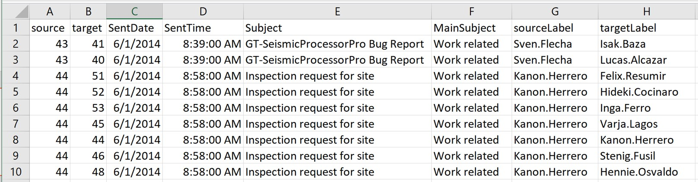
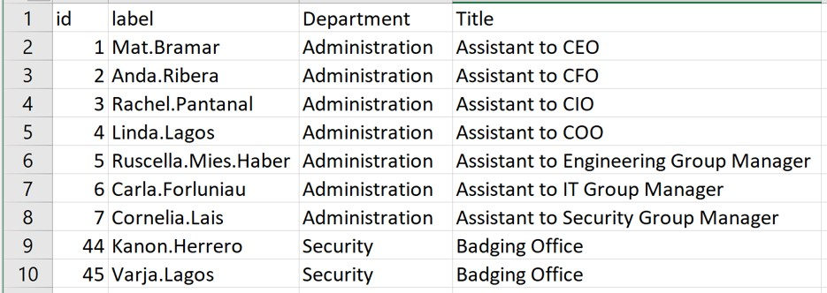
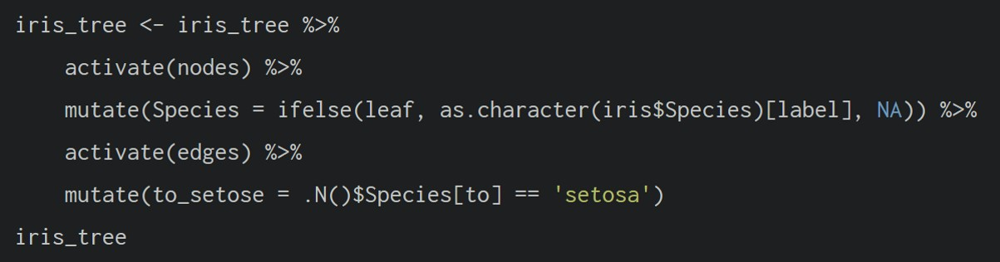

# Modelling, Visualising and Analysing Network Data with R

##  1.  Overview
In this hands-on exercise, we will learn how to model, analyse and visualise network data using R. By the end of this exercise, we will be able to 

- Create graph object data frames, manipulate them using appropriate functions of *dplyr*, *lubridate* and *tidygraph*
- Build network graph visualisation using appropriate functions of *ggraph*
- Compute network geometrics using *tidygraph*
- Build advanced graph visualisation by incorporating the network geometrics
- Build interactive network visualisation using *visNetwork* package

##  2.  Getting Started

### 2.1 Installing and Launching R Packages
In this exercise, four network data modelling and visualisation packages will be installed and launched. They are *igraph.* *tidygraph*, *ggraph* and *visNetwork*. Beside these four packages, *tidyverse* and  [*lubridate*](https://lubridate.tidyverse.org/), an R package specially designed to handle and wrangling time data will be installed and launched too. 

```{r}
#| code-fold: true
pacman::p_load(igraph, tidygraph, ggraph, 
               visNetwork, lubridate, clock,
               tidyverse, graphlayouts, 
               concaveman, ggforce)
```

## 3. The Data
The data sets used in this exercise is from an oil exploration and extraction company. There are two data sets: one contains the nodes data and the other contains the edges (also known as link) data. 

### 3.1 The Edges Data
- *GAStech_email_edges.csv* which consists of two weeks of 9063 emails correspondences between 55 employees. 



### 3.2 The Nodes Data
- *GAStech_email_edges.csv* which consist of the names, department and title of the 55 employees. 



### 3.3 Importing Network Data from files
In this step, we will import *GAStech_email_node.csv* and *GAStech_email_edges-v2.csv* into RStudio environment by using `read_csv()` of **readr** package. 

```{r}
#| code-fold: true
GAStech_nodes <- read_csv("data/GAStech_email_node.csv")
GAStech_edges <- read_csv("data/GAStech_email_edge-v2.csv")
```

### 3.4 Reviewing the Imported Data
Next, we should examine the strucure of the data frame using *glimpse()* of **dplyr**. 

```{r}
#| code-fold: true
glimpse(GAStech_edges)
```
::: callout-warning
## Warning
The output report of *GAStech_edges* above reveals that the *SentDate* is treated as "Character" data type instead of *date* data type. This is an error! Before we continue, it is important for us to change the data type of *SentDate* field back to "Date" data type.  
:::

### 3.5 Wrangling Time
The code chunk below will perform the changes, and also add an additional column *Weekday*. Table below shows the data structure of the reformatted GAStech_edges data frame
```{r}
#| code-fold: true
GAStech_edges <- GAStech_edges %>%
  mutate(SentDate = dmy(SentDate)) %>%
  mutate(Weekday = wday(SentDate,
                        label = TRUE,
                        abbr = FALSE))

glimpse(GAStech_edges)
```
::: callout-note
## Things to learn from the code chunk above
- Both *dmy()* and *wday()* are functios of **lubridate** package. [lubridate](https://r4va.netlify.app/cran.r-project.org/web/packages/lubridate/vignettes/lubridate.html) is an R package that makes it easier to work with dates and times. 
- *dmy()* transforms the SentDate to Date data type. 
- *wday()* returns the day of the week as a decimal number or an ordered factor if label is TRUE. The argument abbr is FALSE will keep the day spells in full, i.e. Monday. The function will create a new column in the data.frame i.e. Weekday and the output of *wday()* will save in this newly created field. 
- The values in the *Weekday* field are in ordinal scale. 
:::

### 3.6 Wrangling Attributes
A close examination of *GAStech_edges* data.frame reveals that it consists of individual email flow records. This is not very useful for visualisation. In view of this, we will aggregate the individuals by date, senders, receivers, main subject and day of the week. 
```{r}
#| code-fold: true
GAStech_edges_aggregated <- GAStech_edges %>%
  filter(MainSubject == "Work related") %>%
  group_by(source, target, Weekday) %>%
    summarise(Weight = n(),
            .groups = "drop") %>%
  filter(source!=target) %>%
  filter(Weight > 1) %>%
  ungroup()
```
::: callout-note
## Things to learn from the code chunk above
- Four functions from **dplyr** package are used. They are: *filter()*, *group()*, *summarise()*, and *ungroup()*.
- The output data.frame is called **GAStech_edged_aggregated**. 
- A new field called Weight has been added in GAStech_edges_aggregated.  
:::

### 3.7 Reviewing the Revised Edges File
Table below shows the data structure of the reformatted *GAStech_edges* data frame: 
```{r}
#| code-fold: true
glimpse(GAStech_edges_aggregated)
```
##  4.  Creating Network Objects using tidygraph
In this section, we will learn how to create a graph data model by using **tidygraph** package. It provides a tidy API for graph / network manipulation. While network data itself is not tidy, it can be envisioned as two tidy tables, one for node data and one for edge data. tidygraph provides a way to switch between the two tables and provides dplyr verbs for manipulating them. Furthermore it provides access to a lot of graph algorithms with retunr values that facilitate their use in a tidy workflow. 

Before getting started, we should read these two articles: 

- [Introducing tidygraph](https://www.data-imaginist.com/2017/introducing-tidygraph/)
- [tidygraph 1.1 - A tidy hope](https://www.data-imaginist.com/2018/tidygraph-1-1-a-tidy-hope/)

### 4.1 The tbl_graph Object
Two functions of **tidygraph** package can be used to create network objects, they are: 

- [tbl_graph()](https://tidygraph.data-imaginist.com/reference/tbl_graph.html) creates a **tbl_graph** network object from nodes and edges data. 

- [as_tbl_graph()](https://tidygraph.data-imaginist.com/reference/tbl_graph.html) converts network data and objects to a **tbl_graph** network. Below are network data and objects supported by `as_tbl_graph`

  - a node data.frame and an edge data.frame
  - data.frame, list, matrix from base
  - igraph from igraph
  - network from network
  - dendrogram and hclust from stats
  - node from data.tree
  - phylo and evonet from ape
  - graphNEL, graphAM, graphBAM from graph (in Bioconductor)

### 4.2 The dplyr verbs in tidygraph
- *activate()* verb from **tidygraph** serves as a switch between tibbles for nodes and edges. All dplyr verbs applied to **tbl_graph** object are applied to the active tibble. 

{width=100%}

- In the above code chunk, the *.N()* function is used to gain access to the node data while manipulating the edge data. Similarly *.E()* will give you the edge data and *.G()* will give you the **tbl_graph** object itself. 

### 4.3 Using `tbl_graph()` to build tidygraph Data Model
In this section, we will use `tbl_graph()` of **tidygraph** package to build an tidygraph's network graph data.frame. 

It is recommended to refer to [tbl_graph()](https://tidygraph.data-imaginist.com/reference/tbl_graph.html) reference guide again. 
```{r}
#| code-fold: true
GAStech_graph <- tbl_graph(nodes = GAStech_nodes,
                           edges = GAStech_edges_aggregated, 
                           directed = TRUE)
```

### 4.4 Reviewing the Output tidygraph's Graph Object
```{r}
#| code-fold: true
GAStech_graph
```

### 4.5 Reviewing the output tidygraph's Graph Object
- The output above reveals that *GAStech_graph* is a *tbl_graph* object with 54 nodes and 1,456 edges. 
- The command also prints the first siz rows of "Node Data" and the first three "edge Data". 
- It states that the Node Data is **active**. The otion of an active tibble within a tbl_graph object makes it possible to manipulated the data in one tibble at a time. 

### 4.6 Changing the Active Object
The nodes tibble data frame is activated by default, but you can change which tibble data frame is active with the *activate()* function.  Thus, if we wanted to rearrange the rows in the edges tibble to list those with the highest "weight' first, we could use *activate()* and then *arrange()*. For example, 
```{r}
#| code-fold: true
GAStech_graph %>%
  activate(edges) %>%
  arrange(desc(Weight))
```
Visit the reference guide of [*activate()*](https://tidygraph.data-imaginist.com/reference/activate.html) to find out more about the function. 

##  5.  Plotting Static Network Graphs with ggraph Package
[ggraph](https://ggraph.data-imaginist.com/) is an extension of **ggplot2**, making it easier to carry over basic ggplot skills to the desgin of network graphs. 

As in all network graph, there are three main aspects to a **ggraph**'s network graph, they are: 

- [nodes](https://cran.r-project.org/web/packages/ggraph/vignettes/Nodes.html)
- [edges](https://cran.r-project.org/web/packages/ggraph/vignettes/Edges.html)
- [layouts](https://cran.r-project.org/web/packages/ggraph/vignettes/Layouts.html)

For a comprehensive discussion of each of these aspect of graph, please refer to their respective vignettes provided. 

:::: {.panel-tabset}

### 5.1 Basic Network Graph
The code chunk below uses [ggraph()](https://ggraph.data-imaginist.com/reference/ggraph.html), [geom_edge_link()](https://ggraph.data-imaginist.com/reference/geom_edge_link.html) and [geom_node_point()](https://ggraph.data-imaginist.com/reference/geom_node_point.html) to plot a network graph by using *GAStech_graph*. Before you get started, it is advisable to read their respective reference guide at least once.  
```{r}
#| label: basic-network-graph
#| code-fold: true
#| fig-width: 12
#| fig-height: 8

ggraph(GAStech_graph) +
  geom_edge_link() +
  geom_node_point()
```
::: callout-note
## Things to learn from the code chunk above
- The basic plotting function is `ggraph()`, which takes the data to be used for the graph and the type of layout desired. Both of the arguments for `ggraph()` are built around *igraph*. Therefore, `ggraph()` can use either an *igraph* object or a *tbl_graph* object. 
:::

### 5.2 Changing Default Network Graph Theme
In this section we will use [theme_graph()](https://ggraph.data-imaginist.com/reference/theme_graph.html) to remove the x and y axes. 
```{r}
#| label: network-theme-graph
#| code-fold: true
#| fig-width: 12
#| fig-height: 8

g <- ggraph(GAStech_graph) + 
  geom_edge_link(aes()) +
  geom_node_point(aes())

g + theme_graph()
```
::: callout-note
## Things to learn from the code chunk above
- **ggraph** introduces a special ggplot theme that provides better defaults for network graphs than the normal ggplot defaults. `theme_graph()`, besides removing axes, grids, and border, changes the font to Arial Narrow (this can be overridden). 
- The ggraph theme can be set for a series of plots with the `set_graph_style()` command run before the graphs are plotted or by using `theme_graph()` in the individual plots. 
:::

### 5.3 Changing Colouring of Plot
Furthermore, `theme_graph()` makes it easy to change the colouring of the plot. 
```{r}
#| label: network-dark-theme
#| code-fold: true
#| warning: false
#| fig-width: 12
#| fig-height: 8

g <- ggraph(GAStech_graph) +
  geom_edge_link(
    aes(colour = "grey50"),
  ) +
  geom_node_point(
    aes(colour = "grey40"),
  )

g + theme_graph(
  background = "grey10",
  text_colour = "white"
)
```
### 5.4 ggraph's Layouts
**ggraph** supports many layout for standard use, like *star*, *circle*, *nicely* (default), *dh*, *gem*, *graphopt*, *mds*, *sphere*, *randomly*, *fr*, *kk*, *drl* and *lgl.* Figures below shows layouts supported by `ggraph()`. 
```{r}
#| echo: false
#| out-width: "100%"
#| fig-align: center

knitr::include_graphics("data/ggraph_layouts.jpg")
```
```{r}
#| echo: false
#| out-width: "100%"
#| fig-align: center

knitr::include_graphics("data/ggraph_layouts2.jpg")
```

### 5.5 Fruchterman and Reingold Layout
Plotting the network graph using Fruchterman and Reingold layout. 
```{r}
#| label: Fruchterman and Reingold layout
#| code-fold: true
#| warning: false
#| fig-width: 12
#| fig-height: 8

g <- ggraph(GAStech_graph, 
            layout = "fr") +
  geom_edge_link(aes()) +
  geom_node_point(aes())

g + theme_graph()
```
::: callout-note
## Things to learn from the code chunk above
- *layout* argument is used to define the layout to be used.
:::

### 5.6 Modifying Network Nodes
We can colour each node by referring to their respective departments. 
```{r}
#| label: network-colour-nodes
#| code-fold: true
#| warning: false
#| fig-width: 12
#| fig-height: 8

g <- ggraph(GAStech_graph, 
            layout = "nicely") + 
  geom_edge_link(aes()) +
  geom_node_point(aes(colour = Department), 
                  size = 3)

g + theme_graph()
```
::: callout-note
## Things to learn from the code chunk above
- *geom_node_point* is equivalent in functionality to *geom_point* of **ggplot2**. It allows for simple plotting of nodes in different shapes, colours and sizes. In the codes chunks above, colour and size are used.  
:::

### 5.7 Modifying Edges
The thickness of the edges can be mapped with the *Weight* variable. 
```{r}
#| label: network-thickness-edges
#| code-fold: true
#| warning: false
#| fig-width: 12
#| fig-height: 8

g <- ggraph(GAStech_graph,
            layout = "nicely") +
  geom_edge_link(
    aes(width = Weight),
    alpha = 0.2
  ) +
  scale_edge_width(range = c(0.1, 5)) +
  geom_node_point(
    aes(colour = Department),
    size = 3
  )

g + theme_graph()
```
::: callout-note
## Things to learn from the code chunk above
- *geom_edge_link* draws edges in the simplest way - as straight lines between the start and end nodes. But, it can do more than that. In the example above, argument *width* is used to map the width of the line in proportion to the Weight attribute and argument alpha is used to introduce opacity on the line. 
:::

::::

##  6.  Creating facet graphs 
Another very useful feature of *ggraph* is faceting. In visualisation network data, this technique can be used to reduce edge over-plotting in a very meaning way by spreading nodes and edges out based on their attributes. In this section, we will use faceting technique to visualise network data. 

There are three functions in ggraph to implement faceting: 

- [facet_nodes()](https://ggraph.data-imaginist.com/reference/facet_nodes.html) whereby edges are only drawn in a panel if both terminal nodes are present 
- [facet_edges()](https://ggraph.data-imaginist.com/reference/facet_edges.html) whereby nodes are always drawn in a panels even if the node data contains an attribute named the same as the one used for the edge facetting 
- [facet_graph()](https://ggraph.data-imaginist.com/reference/facet_graph.html) faceting on two variables simultaneously

:::: {.panel-tabset}
### 6.1 *facet_edges()*
```{r}
#| label: network-facet_edges
#| code-fold: true
#| warning: false
#| fig-width: 12
#| fig-height: 8

set_graph_style()

g <- ggraph(GAStech_graph, 
            layout = "nicely") + 
  geom_edge_link(aes(width=Weight), 
                 alpha=0.2) +
  scale_edge_width(range = c(0.1, 5)) +
  geom_node_point(aes(colour = Department), 
                  size = 2)

g + facet_edges(~Weekday)
```
### 6.2 *facet_edges()* with *theme()*
Using *theme()* to change the position of the legend.
```{r}
#| label: network-facet_edges-themes
#| code-fold: true
#| warning: false
#| fig-width: 12
#| fig-height: 8

set_graph_style()

g <- ggraph(GAStech_graph, 
            layout = "nicely") + 
  geom_edge_link(aes(width=Weight), 
                 alpha=0.2) +
  scale_edge_width(range = c(0.1, 5)) +
  geom_node_point(aes(colour = Department), 
                  size = 2) +
  theme(legend.position = 'bottom')
  
g + facet_edges(~Weekday)
```
### 6.3 Framed facet graph
Adding frame to each graph. 
```{r}
#| label: network-facet_edges-framed
#| code-fold: true
#| warning: false
#| fig-width: 12
#| fig-height: 8

set_graph_style() 

g <- ggraph(GAStech_graph, 
            layout = "nicely") + 
  geom_edge_link(aes(width=Weight), 
                 alpha=0.2) +
  scale_edge_width(range = c(0.1, 5)) +
  geom_node_point(aes(colour = Department), 
                  size = 2)
  
g + facet_edges(~Weekday) +
  th_foreground(foreground = "grey80",  
                border = TRUE) +
  theme(legend.position = 'bottom')
```
### 6.4 *facet_nodes()*
```{r}
#| label: network-facet_nodes
#| code-fold: true
#| warning: false
#| fig-width: 12
#| fig-height: 8

set_graph_style()

g <- ggraph(GAStech_graph, 
            layout = "nicely") + 
  geom_edge_link(aes(width=Weight), 
                 alpha=0.2) +
  scale_edge_width(range = c(0.1, 5)) +
  geom_node_point(aes(colour = Department), 
                  size = 2)
  
g + facet_nodes(~Department)+
  th_foreground(foreground = "grey80",  
                border = TRUE) +
  theme(legend.position = 'bottom')
```
::::

##  7.  Network Metrics Analysis

### 7.1 Computing Centrality Indices
Centrality measures are a collection of statistical indices used to describe the relative importance of the actors are to a network. There are four well-known centrality measures, namely: degree, betweenness, closeness and eigenvector. It is beyond the scope of this hands-on exercise to cover the principles and mathematics of these measure here. Refer to *Chapter 7: Actor Prominence* of **A User's Guide to Network Analysis in R** to gain better understanding of these network measures. 

### 7.2 Visualising Centrality Measures
Besides betweenness centrality, other centrality measures can also be used to examine the relative importance of nodes in the network. In this section, four centrality measures are compared: betweenness, degree, closeness and eigenvector centrality.

:::: {.panel-tabset}

#### Betweenness Centrality

```{r}
#| label: centrality-betweenness
#| code-fold: true
#| warning: false
#| fig-width: 12
#| fig-height: 8

g <- GAStech_graph %>%
  mutate(betweenness_centrality = centrality_betweenness()) %>%
  ggraph(layout = "fr") +
  geom_edge_link(aes(width = Weight),
                 alpha = 0.2) +
  scale_edge_width(range = c(0.1, 5)) +
  geom_node_point(aes(colour = Department,
                      size = betweenness_centrality))

g + theme_graph() +
  theme(legend.position = "bottom")
```
::: callout-note
## Things to learn from the code chunk above
- *mutate()* of **dplyr** is used to perform the computation
- the algorithm used, on the other hand, is the *centrality_betweenness()* of **tidygraph**
:::

#### Degree Centrality

```{r}
#| label: centrality-degree
#| code-fold: true
#| warning: false
#| fig-width: 12
#| fig-height: 8

g <- GAStech_graph %>%
  mutate(degree_centrality = centrality_degree()) %>%
  ggraph(layout = "fr") +
  geom_edge_link(aes(width = Weight),
                 alpha = 0.2) +
  scale_edge_width(range = c(0.1, 5)) +
  geom_node_point(aes(colour = Department,
                      size = degree_centrality))

g + theme_graph() +
  theme(legend.position = "bottom")
```

#### Closeness Centrality

```{r}
#| label: centrality-closeness
#| code-fold: true
#| warning: false
#| fig-width: 12
#| fig-height: 8

g <- GAStech_graph %>%
  mutate(closeness_centrality = centrality_closeness()) %>%
  ggraph(layout = "fr") +
  geom_edge_link(aes(width = Weight),
                 alpha = 0.2) +
  scale_edge_width(range = c(0.1, 5)) +
  geom_node_point(aes(colour = Department,
                      size = closeness_centrality))

g + theme_graph() +
  theme(legend.position = "bottom")
```

#### Eigenvector Centrality

```{r}
#| label: centrality-eigenvector
#| code-fold: true
#| warning: false
#| fig-width: 12
#| fig-height: 8

g <- GAStech_graph %>%
  mutate(eigenvector_centrality = centrality_eigen()) %>%
  ggraph(layout = "fr") +
  geom_edge_link(aes(width = Weight),
                 alpha = 0.2) +
  scale_edge_width(range = c(0.1, 5)) +
  geom_node_point(aes(colour = Department,
                      size = eigenvector_centrality))

g + theme_graph() +
  theme(legend.position = "bottom")
```
::::

### 7.3 Visualising Community
tidygraph package inherits many of the community detection algorithms into igraph and makes them available to us, including *Edge-betweenness (group_edge_betweenness)*, *Leading eigenvector (group_leading_eigen)*, *Fast-greedy (group_fast_greedy)*, *Louvain (group_louvain)*, *Walktrap (group_walktrap)*, *Label propagation (group_label_prop)*, *InfoMAP (group_infomap)*, *Spinglass (group_spinglass)*, and *Optimal (group_optimal)*. Some community algorithms are designed to take into account direction or weight, while others ignore it. Click this [link](https://tidygraph.data-imaginist.com/reference/group_graph.html) to find out more about community detection functions provided by tidygraph. 

:::: {.panel-tabset}

####  *group_edge_betweenness()*
```{r}
#| label: community-group_edge_betweenness
#| code-fold: true
#| warning: false
#| fig-width: 12
#| fig-height: 8

g <- GAStech_graph %>%
  mutate(community = as.factor(
    group_edge_betweenness(
      weights = Weight, 
      directed = TRUE))) %>%
  ggraph(layout = "fr") + 
  geom_edge_link(
    aes(
      width=Weight), 
    alpha=0.2) +
  scale_edge_width(
    range = c(0.1, 5)) +
  geom_node_point(
    aes(colour = community))  

g + theme_graph()
```

####  *group_optimal* with `geom_mark_hull()`
```{r}
#| label: community-group_optimal-geom_mark_hull
#| code-fold: true
#| warning: false
#| fig-width: 12
#| fig-height: 8

g <- GAStech_graph %>%
  activate(nodes) %>%
  mutate(community = as.factor(
    group_optimal(weights = Weight)),
         betweenness_measure = centrality_betweenness()) %>%
  ggraph(layout = "fr") +
  geom_mark_hull(
    aes(x, y, 
        group = community, 
        fill = community),  
    alpha = 0.2,  
    expand = unit(0.3, "cm"),  # Expand
    radius = unit(0.3, "cm")  # Smoothness
  ) + 
  geom_edge_link(aes(width=Weight), 
                 alpha=0.2) +
  scale_edge_width(range = c(0.1, 5)) +
  geom_node_point(aes(fill = Department,
                      size = betweenness_measure),
                      color = "black",
                      shape = 21)
  
g + theme_graph() +
  theme(legend.position = "bottom")
```

::::

##  8.  Building Interactive Network Graph with visNetwork
- [visNetwork()](http://datastorm-open.github.io/visNetwork/) is a R package for network visualisation, using [vis.js](http://visjs.org/) javascript library. 

- *visNetwork()* function uses a nodes list and edges list to create an interactive graph. 
  
  - The nodes list must include an "id" column, and the edge list must have "from" and "to" columns. 
  - The function also plots the labels for the nodes, using the names of the actors from the "label" column in the node list. 

- The resulting graph is fun to play around with. 

  - We can move the nodes and the graph will use an algorithm to keep the nodes properly spaced. 
  - We can also zoom in and out of the plot and move it around to re-center it. 

### 8.1 Data Preparation
Before we can plot the interactive network graph, we need to prepare the data model by using the code chunk below: 
```{r}
#| code-fold: true
#| warning: false

GAStech_edges_aggregated <- GAStech_edges %>%
  left_join(GAStech_nodes, by = c("sourceLabel" = "label")) %>%
  rename(from = id) %>%
  left_join(GAStech_nodes, by = c("targetLabel" = "label")) %>%
  rename(to = id) %>%
  filter(MainSubject == "Work related") %>%
  group_by(from, to) %>%
    summarise(weight = n()) %>%
  filter(from!=to) %>%
  filter(weight > 1) %>%
  ungroup()
```
### 8.2 Plotting the First Interactive Network Graph
The code chunk below will be used to plot an interactive network graph by using the data prepared above. 
```{r}
#| code-fold: true
#| warning: false

visNetwork(GAStech_nodes, 
           GAStech_edges_aggregated)
```

:::: {.panel-tabset}

### 8.3 With layout
Fruchterman and Reingold layout is used. 
```{r}
#| label: visNetwork-layout_with_fr
#| code-fold: true
#| warning: false

visNetwork(GAStech_nodes,
           GAStech_edges_aggregated) %>%
  visIgraphLayout(layout = "layout_with_fr") 
```
Visit [Igraph](http://datastorm-open.github.io/visNetwork/igraph.html) to find out more about *visIgraphLayout*'s argument. 

### 8.4 With visual attributes - Nodes
visNetwork() looks for a field called "group" in the nodes object and colour the nodes according to the values of teh group field. 

The code chunk below rename Department field to group. 
```{r}
#| code-fold: true
GAStech_nodes <- GAStech_nodes %>%
  rename(group = Department) 
```
visNetwork shades the nodes by assigning unique colour to each category in the *group* field. 
```{r}
#| label: visNetwork-nodes
#| code-fold: true
#| warning: false

visNetwork(GAStech_nodes,
           GAStech_edges_aggregated) %>%
  visIgraphLayout(layout = "layout_with_fr") %>%
  visLegend() %>%
  visLayout(randomSeed = 123)
```

### 8.5 With visual attributes - Edges
visEdges() is used to symbolise the edges. 
- The *arrows* argument is used to define where to place the arrow. 
- The *smooth* argument is used to plot the edges using a smooth curve. 
```{r}
#| label: visNetwork-edges
#| code-fold: true
#| warning: false

visNetwork(GAStech_nodes,
           GAStech_edges_aggregated) %>%
  visIgraphLayout(layout = "layout_with_fr") %>%
  visEdges(arrows = "to", 
           smooth = list(enabled = TRUE, 
                         type = "curvedCW")) %>%
  visLegend() %>%
  visLayout(randomSeed = 123)
```

### 8.6 With visual attributes - Options
visOptions() is used to incorporate interactivity features in the data visualisation. 
- The *highlightNearest* argument highlights nearest when clicking a node. 
- The *nodesIdSelection* argumant addes an id note selection creating an HTML select element. 
```{r}
#| label: visNetwork-options
#| code-fold: true
#| warning: false

visNetwork(GAStech_nodes,
           GAStech_edges_aggregated) %>%
  visIgraphLayout(layout = "layout_with_fr") %>%
  visOptions(highlightNearest = TRUE,
             nodesIdSelection = TRUE) %>%
  visLegend() %>%
  visLayout(randomSeed = 123)
```
Visit [Option](http://datastorm-open.github.io/visNetwork/options.html) to find out more about visOption's argument. 

::::