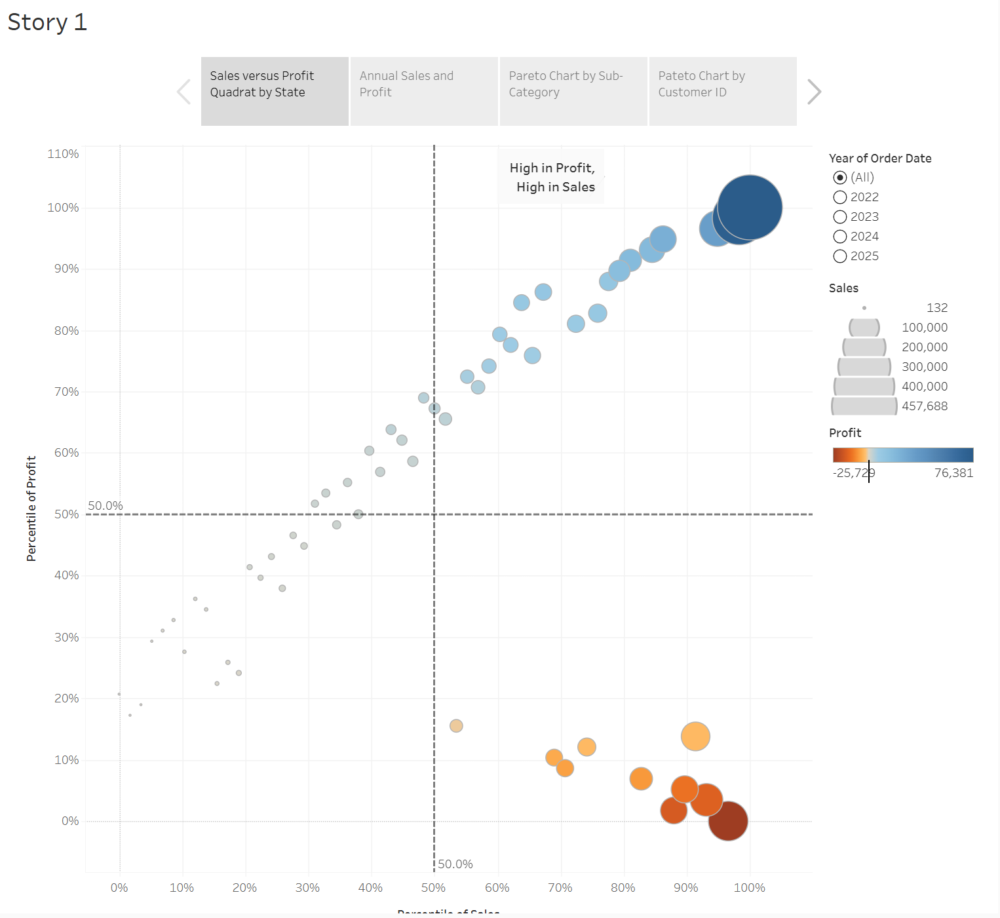
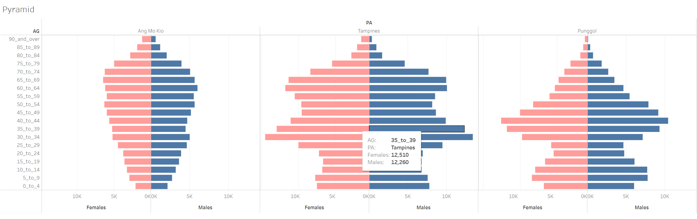

[In-Class_Ex03](https://public.tableau.com/app/profile/albert.chia/viz/In-Class_Ex03_17777076298480/Story1)

[In-Class_Ex03b](https://public.tableau.com/app/profile/albert.chia/viz/In-Class_Ex03b/Pyramid)
